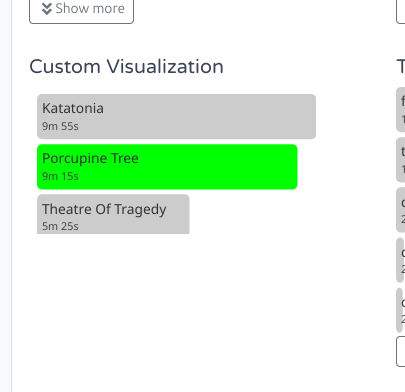

# Media Player watcher

This watcher sends information the media which is playing now to [ActivityWatch](https://activitywatch.net/).
It supports any player which can report its status to the system 
and be controllable by tray or standard multimedia keys,
such as Spotify, Foobar, browser-based players, and others. Most media players are supported.

| Environment   | Support                        |
| ------------- | -------------------------------|
| Linux         | :heavy_check_mark: Yes ([MPRIS](https://specifications.freedesktop.org/mpris-spec/latest/)) |
| Windows       | :heavy_check_mark: Yes         |
| MacOS         | :hourglass: Not yet supported  |

<details>
<summary>Examples of reported data</summary>

Spotify in Linux:
```json
{
  "album": "How to Measure a Planet? (Deluxe Edition)",
  "artist": "The Gathering",
  "player": "Spotify",
  "title": "My Electricity",
  "uri": "https://open.spotify.com/track/1cSWc2kX4z39L5uFdGcjFP"
}
```
Firefox in Linux (no plugins):
```json
{
    "artist": "Eileen",
    "player": "Mozilla Firefox",
    "title": "🇺🇦 🇵🇱 Гей, соколи! / Hej, sokoły! – Ukrainian/Polish folk song"
}
```
MS Edge in Windows:
```json
{
  "artist": "Bel Canto Choir Vilnius",
  "player": "MSEdge",
  "title": "Shchedryk (Carol of the Bells) – Bel Canto Choir Vilnius"
}
```
Default Windows player
```json
{
  "album": "Zemlya",
  "artist": "Okean Elzy",
  "player": "Microsoft.ZuneMusic_8wekyb3d8bbwe!Microsoft.ZuneMusic",
  "title": "Obijmy"
}
```

</details>

## Installation

- **Linux**:
  - Run `sudo unzip -j aw-watcher-media-player-linux.zip aw-watcher-media-player-linux -d /usr/local/bin` in the console to allow ActivityWatch to detect its presence.
    - Optionally, to use visualizations, run `sudo unzip -d /usr/local/share/aw-watcher-media-player/visualization aw-watcher-media-player-linux.zip 'visualization/*'`.
  - Or install the attached _.deb_ file.

  **Windows**:
  - Run the attached installer executable.
  - To install manually and make it available for ActivityWatch,
    unpack the executable from `aw-watcher-media-player-windows.zip` into any new folder,
    right-click on "Start" -> "System" -> "Advanced system settings" - "Advanced" tab -> "Environment Variables..." -> upper "Edit...", add the new folder path.
- Optionally, add `aw-watcher-media-player` to autostart at `aw-qt/aw-qt.toml` in [config directory](https://docs.activitywatch.net/en/latest/directories.html#config).

## Configuration

Configuration file `aw-watcher-media-player.toml` is located in [user's local configuration directory](https://docs.rs/dirs/latest/dirs/fn.config_local_dir.html).
It's created on the first run, or it may be created manually before running the binary.
CLI arguments override the file configuration.
Example:
```toml
port = 5600
host = "localhost"
poll_time = 5
include_players = ["Spotify", "firefox", "chrom"]
exclude_players = ["chromium"]
```
Filter options for including and excluding players for reporting look for a case-insensitive substring.
Use `-vv` to see what's reported.

**Note that normally browsers report the currently playing media to the system even in a private mode/tab/window.**

## Custom Visualization



This watcher has a visualization which attempts to do its best to display the sorted list of artists with the overall play time for each artist.
Note that ActiveWatch UI gives no abilities for the widget to control its sizing, so it may appear smaller than builtin visualizations.

1. Add the following section to your aw-server/aw-server.toml or aw-server-rust/config.toml file in [config directory](https://docs.activitywatch.net/en/latest/directories.html#config):
    ```toml
    [server.custom_static]
    aw-watcher-media-player = "/path/to/aw-watcher-media-player/visualization"
    # aw-watcher-media-player = "/usr/share/aw-watcher-media-player/visualization" # .deb installation
    # aw-watcher-media-player = "/usr/local/share/aw-watcher-media-player/visualization" # Linux installation from archive
    # aw-watcher-media-player = 'C:\Users\<USER>\AppData\Local\aw-watcher-media-player\visualization' # Windows installer
    ```
2. Restart ActivityWatch
3. Add custom visualizations from the Activity Watch GUI: `Activity > Edit View > Add Visualization > Custom Visualization`
4. Enter `aw-watcher-media-player` for the watcher name.

The visualization is not customizable from ActivityWatch UI. In order to change, the output, open `index.html`:
- Find `getAggregation` function and change `event.data.artist` to `event.data.player` to aggregate by players.
- Change `MAX_AGGREGATIONS` to determine the maximum number of entries (default is 50).

## Build

`cargo build --release` on any platform. See [_release.yml_](https://github.com/2e3s/aw-watcher-media-player/blob/main/.github/workflows/release.yml) for details.
